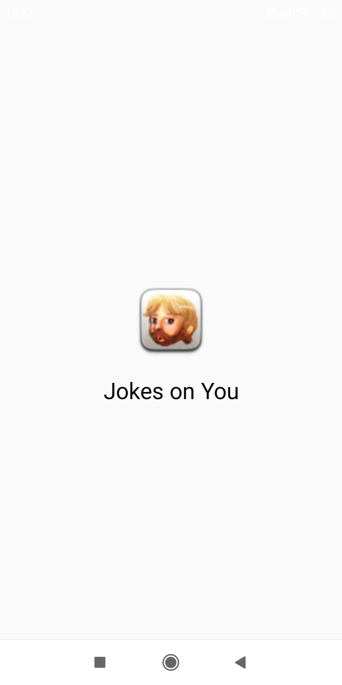
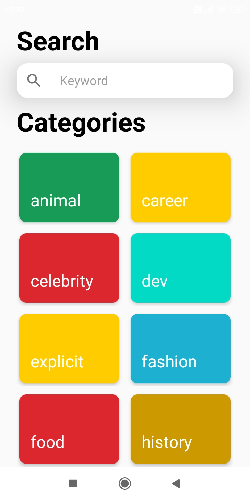
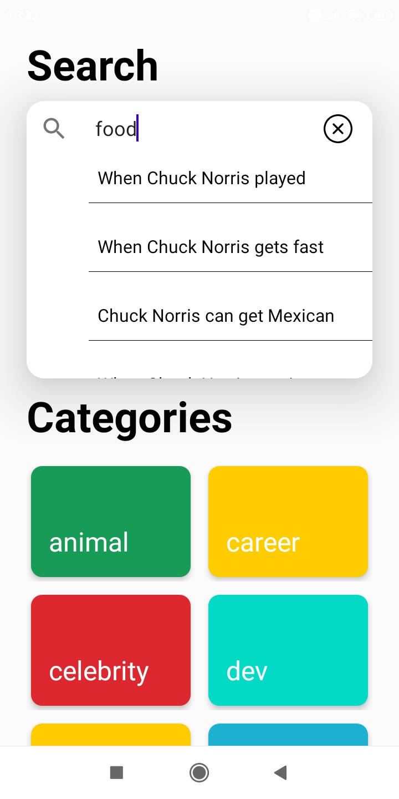
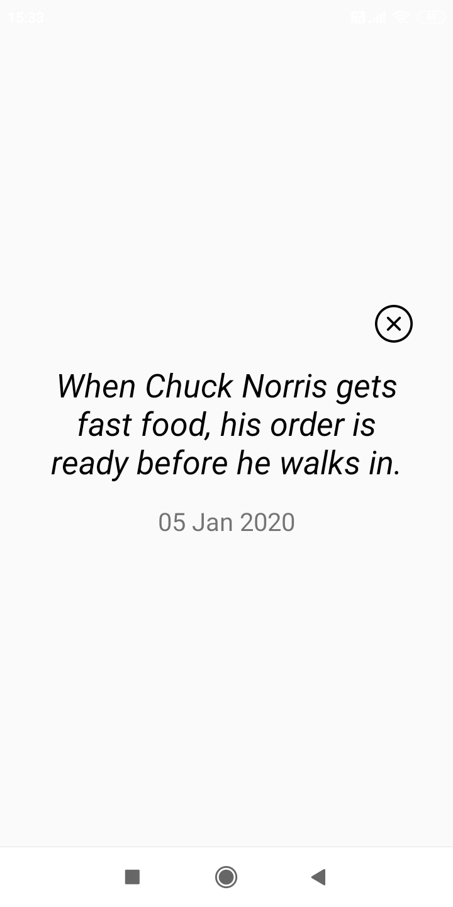
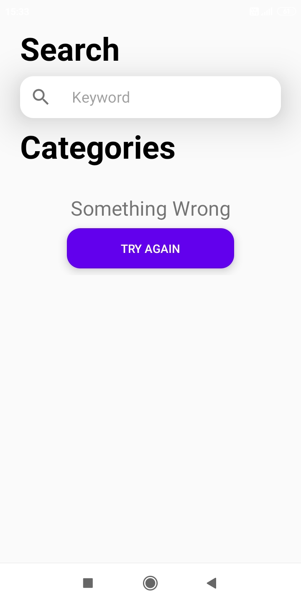

# Jokes on You

Android app to read the best Chuck Norris jokes for made your day =)

## Credits
Special thanks to [chucknorris.io](https://api.chucknorris.io/) for data sources.

I used:
- [Retrofit](https://square.github.io/retrofit/) by Square for HTTP client.
- [OkHttp](https://github.com/square/okhttp) by Square for HTTP client Log and Interceptor.
- [NetworkResponse](https://github.com/haroldadmin/NetworkResponseAdapter) by haroldadmin for wrapping API responses in a NetworkResponse class using Coroutines.
- [Koin](https://github.com/InsertKoinIO/koin) by InsertKoinIO for Dependency Injection.
- [SpinKit](https://github.com/ybq/Android-SpinKit) by ybq for loading animation.
- [Android Lifecycle](https://developer.android.com/jetpack/androidx/releases/lifecycle) by Android.
- [Coroutines](https://github.com/Kotlin/kotlinx.coroutines) by Jetbrains.

Screenshot:

